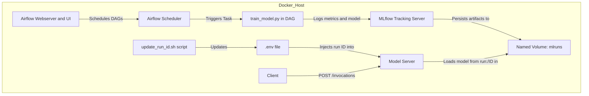

# End-to-End MLOps Pipeline with Airflow, MLflow, Docker

## 🎯 Overview

This project is a **containerized MLOps pipeline** built for training, tracking, and serving machine learning models using:

- **Airflow** for orchestration
- **MLflow** for experiment tracking and model serving
- **Docker Compose** to wire up services for local or VM-based development

I used ChatGPT as a coding assistant in creating this.

---

## 🏗️ Architecture



### 📦 Project Structure

```
mlops_pipeline/
├── airflow/
│   ├── dags/                # Airflow DAGs
│   │   └── ml_pipeline.py   # Orchestrates model training
│   ├── models/
│   │   └── train_model.py   # Handles ML training and logging
│   └── Dockerfile           # Builds the airflow-webserver & scheduler image
├── mlflow/
│   └── Dockerfile           # Installs mlflow and builds the MLFlow images
├── update_run_id.sh         # Standalone script to fetch latest model run ID
├── clean_disk.sh            # Removes Docker volumes/images for a fresh start
├── docker-compose.yml       # Defines services: airflow-webserver, scheduler, mlflow-server, volume-init, model-server
└── README.md                # Primary documentation (updated with new workflow steps)

```

---

## 🧱 Components Explained

### 🌀 Airflow
- **Webserver**: Hosts the DAG UI (`http://localhost:8080`)
- **Scheduler**: Executes tasks defined in DAGs (like training or serving)

### 📊 MLflow
- **Tracking Server**: Logs experiments, metrics, models (`http://localhost:5000`)
- **Model Serve**: Launches a REST API from a trained model (`http://localhost:5001/invocations`)

### 🐳 Docker Compose
- Wires up all containers with correct ports, volumes, and environment variables
- `Dockerfile` is like a recipe for baking your software environment into a standalone image. `docker-compose` is like a kitchen manager: it reads your recipes (Dockerfiles) and tells all the cooks (containers) when and how to work together.

---

## 🛠️ Setup Instructions

### 0. ✅ Setup a GCP VM

Running the whole set up on a GCP VM instance was a lot easier for me. So if you'd like, you can follow these to set up the exact same instance I used for the project.

1. **Create a new VM instance** with the following configuration:
   - **Machine type**: e2-standard-2
   - **Boot disk**: Debian 11
   - **Allow HTTP/HTTPS traffic**
   - **Disk Size**: 50GB
   - **Firewall Rule**:
     - Go to VPC Network → Firewall → Create Firewall Rule
     - Name: `allow-mlflow`
     - Targets: All instances in the network
     - Source IP ranges: `0.0.0.0/0`
     - Protocols and ports: check TCP and add `5000`, `5001`, `8080`
     - Save

### 1. ✅ Clone the Repository

```bash
git clone https://github.com/nikhil-tibrewal/mlops_pipeline.git
cd mlops_pipeline
```

### 2. ✅ Create `.env` with a Fernet Key

```bash
python3 -c "from cryptography.fernet import Fernet; print('FERNET_KEY=' + Fernet.generate_key().decode())" > .env
```

This is required for Airflow to encrypt secrets. We also need a `LATEST_MODEL_RUN_ID` here for the `model-server` to startup correctly, but we'll add that later.

### 3. ✅ Build and Start All Containers

```bash
# Stop all containers and remove old volumes
docker compose down --volumes --remove-orphans
# Rebuild from clean state
docker compose build --no-cache
docker compose up
```

The `--no-cache` option can be omitted to re-use previously built layers. The `model-server` will fail to startup, but this is expected since we don't have a `LATEST_MODEL_RUN_ID` yet. We will fix that later.

This will:
- 🔨 **Build 2 Docker images** using the `Dockerfile` in the `airflow/` and `mlflow/` folders.
  - `airflow/Dockerfile` installs Airflow, scikit-learn, mlflow
  - `mlflow/Dockerfile` installs a minimal Python + MLflow environment
- 📦 **Start 5 containers**:
  - `airflow-webserver` — the Airflow UI and DAG loader
  - `airflow-scheduler` — triggers tasks like training and serving
  - `mlflow-server` — hosts the MLflow UI and tracking backend
  - `model-server` — the MLFlow serve API backend that serves the REST API for the model
  - The 2 airflow services use the same image, and the 2 mlflow images use the same image
  - `volume-init`: a short-lived init service that waits for the `mlruns` volume to be mounted, creates any needed directories and sets ownership to airflow.
    - Note that the `mlflow-server` is run as the `airflow` user. This is because:
        - Airflow (webserver + scheduler) runs as user airflow inside the container (UID 50000).
        - When the Airflow DAG (e.g., `train_model.py`) logs a model with `mlflow.log_model()`, it creates files and directories in `/mlflow/mlruns`.
        - If `mlflow-server` (the tracking server) is not also run as the same user, we get file permission errors (especially during logging or artifact access), because different UID users can’t write to each other’s files inside shared volumes.
        - Running as `airflow` ensures that both airflow and mlflow-server can read/write to the same shared mlruns volume, and artifact logging and serving work cleanly.
    - `volume-init` is needed because:
        - Docker named volumes (`mlruns:` in this case) are created and mounted empty by default.
        - We can't assume the `/mlflow/mlruns` path exists on first startup.
        - `volume-init` creates the directory and a dummy `.init` file inside it
        - Changes ownership to UID 50000 (the airflow user) using `chown -R`
        - Ensures that when Airflow or MLflow write artifacts, there are no permission errors
        - This solves the initial “Permission denied” issues during model logging, especially on fresh setups or rebuilt volumes.
- 🗂️ **Mount local folders as volumes** into the containers:
  - `./airflow/dags → /opt/airflow/dags`
  - `./airflow/models → /opt/airflow/models`
  - Mounting is helpful because Docker images don’t need to be rebuilt when code is changed
  - Named volumed for `mlruns:/mlflow/mlruns` so that it is managed by Docker and shared across containers.

The Airflow DAG (`ml_pipeline.py`) does the following when triggered:
- **Training Task** (`train_model.py`)
  - Loads Iris dataset and trains a `RandomForestClassifier`
  - Logs parameters, metrics, and the model to MLflow
  - MLflow saves the model under the local `mlruns/` directory
- Other training pipeline related tasks can be added here as necessary.

---

### 4. ✅ Initialize Airflow Metadata DB

In a separate window run the following. The containers started above don't need to be stopped to run this since it starts a temporary `airflow-webserver` container and removes it after the command has run (`--rm`).

```bash
docker compose run --rm airflow-webserver airflow db init
```

### 5. ✅ Create Airflow Admin User

In a separate window run the following. This creates the user in the local database being used by Airflow.

```bash
docker compose run --rm airflow-webserver airflow users create \
  --username admin \
  --password admin \
  --firstname Admin \
  --lastname User \
  --role Admin \
  --email admin@example.com
```

### 6. ✅ Running the Training Pipeline

1. Go to `http://localhost:8080`
2. Log in with:
   - Username: `admin`
   - Password: `admin`
3. Trigger the DAG `mlops_pipeline`
4. Wait for pipeline to complete.
5. Confirm that the MLFlow tracking UI shows the latest run at `http://localhost:5000`

### 7. ✅ Fix `model-server`

Run the following to set the `LATEST_MODEL_RUN_ID` from the host VM. The `docker-compose.yml` file is able to read the `.env` file directly from the project root directly.

```bash
chmod +x update_run_id.sh
./update_run_id.sh
less .env
```

Ensure that the `.env` file has the `LATEST_MODEL_RUN_ID` and the `FERNET_KEY`. Then restart the `model-server` by running this in another window:

```bash
docker compose up --build model-server --force-recreate
```

Go back to the logs of the containers running, and you should see that the `model-server` has started successfully.

### 8. ✅ Example Prediction Call:

Finally, call the `model-server`'s MLFlow REST API to run a prediction based on the model that was just trained.

```bash
curl -X POST http://localhost:5001/invocations \
  -H "Content-Type: application/json" \
  -d '{"inputs": [[5.1, 3.5, 1.4, 0.2]]}'
```

---

## 🧹 Optional: Clean Up Docker Artifacts

```bash
./clean_disk.sh
```

> This stops containers, prunes volumes, networks, and dangling images.

---

## 📌 Tips

- Run everything from the root project directory
- Use `tmux` to manage backgrounded processes on VMs
- Keep `.env` out of version control (`.gitignore` should include it)
