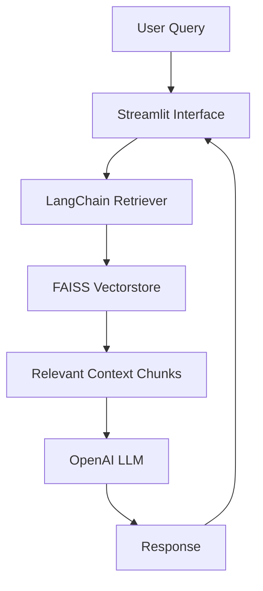

# End-to-End MLOps Pipeline on GCP using Airflow, sklearn and MLFlow

---

## Architecture Overview

```mermaid
graph TD
    A[User Query] --> B[Streamlit Interface]
    B --> C[LangChain Retriever]
    C --> D[FAISS Vectorstore]
    D --> E[Relevant Context Chunks]
    E --> F[OpenAI LLM]
    F --> G[Response]
    G --> B
```
