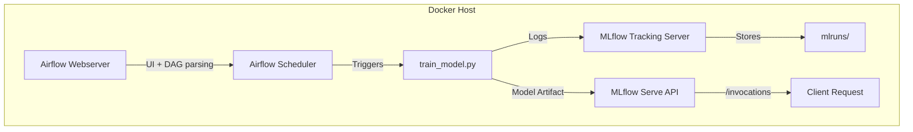

# End-to-End MLOps Pipeline with Airflow, MLflow, Docker

## 🎯 Overview

This project is a **containerized MLOps pipeline** built for training, tracking, and serving machine learning models using:

- **Airflow** for orchestration
- **MLflow** for experiment tracking and model serving
- **Docker Compose** to wire up services for local or VM-based development

I used ChatGPT as a coding assistant in creating this.

---

## 🏗️ Architecture



### 📦 Project Structure

```
mlops_pipeline/
├── airflow/
│   ├── dags/                # Airflow DAGs
│   │   └── ml_pipeline.py
│   └── models/              # Training & serving code
│       ├── train_model.py
│       └── serve_model.py
├── mlruns/                  # MLflow model + metric storage
├── docker-compose.yml       # Multi-service setup
├── .env                     # Secrets (Fernet key)
├── clean_disk.sh            # Optional cleanup script
└── README.md
```

---

## 🧱 Components Explained

### 🌀 Airflow
- **Webserver**: Hosts the DAG UI (`http://localhost:8080`)
- **Scheduler**: Executes tasks defined in DAGs (like training or serving)

### 📊 MLflow
- **Tracking Server**: Logs experiments, metrics, models (`http://localhost:5000`)
- **Model Serve**: Launches a REST API from a trained model (`http://localhost:5001/invocations`)

### 🐳 Docker Compose
- Wires up all containers with correct ports, volumes, and environment variables

---

## 🛠️ Setup Instructions

### 1. ✅ Clone the Repository

```bash
git clone https://github.com/<your-username>/mlops_pipeline.git
cd mlops_pipeline
```

### 2. ✅ Create `.env` with a Fernet Key

```bash
python3 -c "from cryptography.fernet import Fernet; print('FERNET_KEY=' + Fernet.generate_key().decode())" > .env
```

This is required for Airflow to encrypt secrets.

### 3. ✅ Build and Start All Containers

```bash
docker compose build --no-cache
docker compose up
```

---

### 4. ✅ Initialize Airflow Metadata DB

In a separate window run the following. The containers started above don't need to be stopped to run this since it starts a temporary `airflow-webserver` container and removes it after the command has run (`--rm`).

```bash
docker compose run --rm airflow-webserver airflow db init
```

### 5. ✅ Create Airflow Admin User

In a separate window run the following. This creates the user in the local database being used by Airflow.

```bash
docker compose run --rm airflow-webserver airflow users create \
  --username admin \
  --password admin \
  --firstname Admin \
  --lastname User \
  --role Admin \
  --email admin@example.com
```

---

## 🚀 Running the Pipeline

1. Go to `http://localhost:8080`
2. Log in with:
   - Username: `admin`
   - Password: `admin`
3. Trigger the DAG `mlops_pipeline`
4. Monitor logs to see:
   - Model trained via `train_model.py`
   - Logged to MLflow at `http://localhost:5000`
   - Served via REST API at `http://localhost:5001/invocations`

### Example Prediction Call:

```bash
curl -X POST http://localhost:5001/invocations \
  -H "Content-Type: application/json" \
  -d '{"inputs": [[5.1, 3.5, 1.4, 0.2]]}'
```

---

## 🧹 Optional: Clean Up Docker Artifacts

```bash
./clean_disk.sh
```

> This stops containers, prunes volumes, networks, and dangling images.

---

## 📌 Tips

- Run everything from the root project directory
- Use `tmux` to manage backgrounded processes on VMs
- Keep `.env` out of version control (`.gitignore` should include it)
