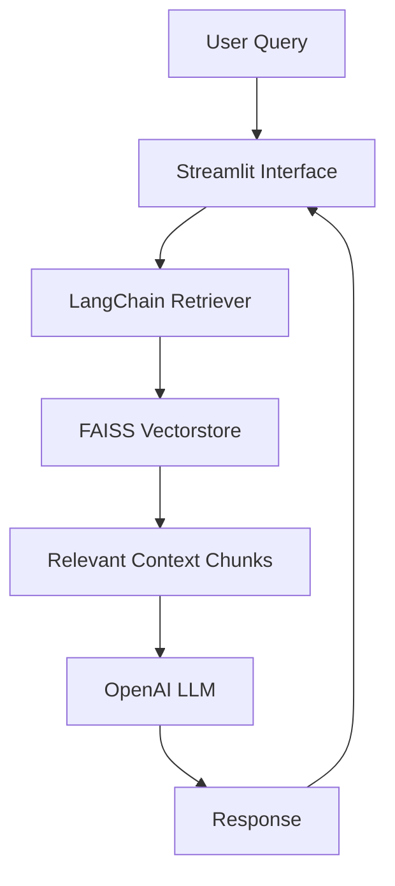

# End-to-End MLOps Pipeline on GCP using Airflow, sklearn and MLFlow

---

## Architecture Overview

Stack:
- Airflow to orchestrate a pipeline
- sklearn to train a simple classification model
- MLflow to log model + metrics
- MLflow Serve to deploy the trained model as a REST API
